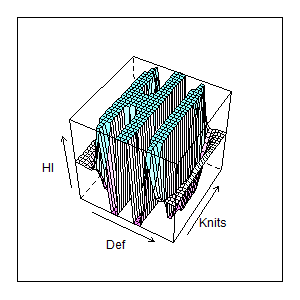
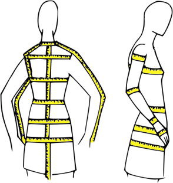
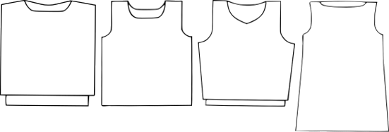
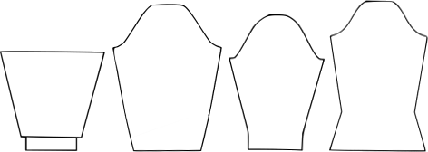

Application for Technology Development
======================================

Autumn 2016
-----------

Project Description
===================

Sproti
------

### Company name: HiDef Textiles

### Project title: HiDef Knits

Instructions
------------

Please following items in the preparation of project descriptions. The applicant
must answer all the items below, otherwise the application dismissed. That reads
"Text" you can write text, insert images or tabletting. The application can not
be longer than 20 pages, excluding the cover, summary, table of contents and
bibliography. It is forbidden to change the width margin nor have the font size
smaller than 11-point Calibri (Body) or equivalent. If application is made for
other than MS Word format example PDF, the applicant must pay close attention to
page number before submitting the application. Those who do not have access to
MS Word are advised to use OneDrive. Additional information and rules can be
found on the website Rannís. The application deadline is at. 16.00 per
application deadline is entirely equation 15 February and 15 September except
where these days carry a weekend or public holiday. The application deadline
moves to the next ordinary working day.

 

Summary
=======

Text (Summary of a maximum 1 page).

 

1 Description of the project
============================

1.1. Objectives
---------------

-   *Describe the project and its objectives. What are the estimated results /
    products project nature are the products (such as tools, equipment,
    software, service).*

There has always a strong tradition of knitting for centuries, with earliest
knitted artifacts dating as far back as 11th century. Many countries have a rich
heritage of knitting, and Iceland is known worldwide for both our unique wool,
such as lopi, and the traditional Icelandic *Lopapeysa,* which is a unique
variation of fair-isle knitting of a blouson with a circular yoke. The renowned
lopapeysa, is relatively new, as it first documentation is from the 60s. But as
years go by, the design of the traditional woolen sweater has changed in line
with fashion trends. There are an endless variations of patterns in terms of
silhouettes and texture. For instance, in the case of the *lopapeysa,* they are
new often buttoned-up, opened up with a zipper, hooded, with inset pockets, and
the list goes on. But all of them share the same underlying baseline structure.

Knitting can be very rewarding, as it’s generally a labor of love. Studies have
shown that knitting has many health benefits[[1]](#_ftn1) as its practice can be a form
of meditation. Knitting used to be considered passé and only for grandmothers,
but in recent years there has been a massive resurgence. Partly due to celebrity
fans like Kate Moss and Amanda Seyfried taking up knitting, but a larger impact
to the knitting revival is thanks to the internet age. Online tutorials help
wannabe knitters to become self-learned novices and later experts. There is also
a large international community on the social networking site
[Ravelry](http://www.raverly.com) that has over 6.21 million registered users.
Ravelry connects knitting and crochets enthusiasts and professionals. It is both
a social platform where users can share and discuss their knitwork, but also a
venue for distributing knitting patterns, both for free and for sale, within the
site. There are also a very lively groups on facebook, such as *Handóðir
prjónarar* with over 17 thousand (mostly) Icelandic members.

Knitters take great pride in their work and most practitioners know of all the
untold hours of knitting disasters and unwanted frogging[[2]](#_ftn2), where a knitter
unravels hours upon hours of meticulous work. This may be due to an error in
reading the pattern or an unflattering fit. Since one size does not fit all, the
objective of this project *HiDef Knits* is to simplify the process of designing
original and altering knitwear with perfect fit and a professional finish.

After consulting 170 Icelandic knitters, 70% had designed a garment for
themselves and 11% had published their work (remaining 19% did not consider
themselves a designer). The majority built their work on existing patterns in
terms of calculating the number of stitches needed. Some created their garments
on the fly, and as a result of their undocumented approach their designs were
not repeatable. Generally, the designers jolted calculations with pen and paper,
but in an erratic way such that they didn’t feel comfortable in publishing their
work with others. Those who published their work mostly used Excel to manage
their calculations and re-sizing.

From personal observations, when knitters share their original designs on social
media, the comment threads are bombarded with questions about pattern
availability. For hobbyist knitters, the excitement of starting a new project
often supersedes detailed preplanning, and there may be last minute alterations
since what you initially planned might not work out due to forgotten decreases
or increases that result in a poorly fitted garment. Therefore, since it’s not
known beforehand if a project will be loved by so many, it’s can be extremely
hard to retrace your steps to publish a pattern in a coherent way for others to
follow, let alone using the appropriate terminology and abbreviations. The HiDef
Knits software objective is to help those aspiring designers (both for personal
use and pattern distributions) for easier preplanning that result in an overall
improved knitting experience as there is minimal painstaking assembly process
due to forgotten structural elements.

A user starts by feeding into the HiDef Knits software all necessary body
measurements needed (cf. Figure 1) for constructing a garment. The first version
of HiDef Knits will solely focus on sweaters, cardigans, dresses and skirts
since they share similar building blocks.[[3]](#_ftn3) For these types of garments there
are a total of 17 body measurements that need to be considered for an individual
fit, namely: shoulder width, chest/bust circumference, armhole depth, raglan
depth, waist circumference, hip circumference, length from hip to waist, front
and back neck length, body length at front and back, length from armhole to
lower edge, sleeve length, upper arm width, wrist width, length from center back
to wrist.

**Figure 1 Measurements**

Based on these body measurements it’s important to incorporate ease (i.e. extra
width) in the pattern design in order for the wearer to move comfortably in a
garment. For instance, 5cm ease for body circumference is sufficient, but 10cm
is preferred when designing outerwear. The HiDef Knits software will make the
necessary ease additions that are appropriate to each pattern shape based on the
user’s choice of style, namely: standard, roomy, tight, form fitting (i.e.
negative ease) or user defined.

From here the software offers constructional elements for the user to play
around with. Figure 2 depicts several classic torso silhouettes (i.e. front and
back pieces) and Figure 3 demonstrates classic sleeve silhouettes that a user
could define in the HiDef Knit software. The user starts by defining the shape
of the garment, and building on classical silhouettes those would be: tapered,
kimono or blouson. Next the user decides on length (cropped, waist, hip or knee
length). This is followed by armhole shaping, the most common silhouettes being
dropped shoulder (cf. left most variation in Figures 2 and 3), set-in shoulder,
raglan, circular yoke (e.g. lopapeysa) or saddle shoulder. The choice of armhole
shaping effects the design of the sleeve piece, and the HiDef Knits software
make sure that the front, back and shoulder pieces all correspond to one another
for perfect joining. This is extremely important for achieving a comfortable
fit. Other design elements for the sleeve piece have to deal with the look
towards the cuff, as they could be a lantern sleeve or straight sleeve with or
without any tapering. If there are cuffs (classic fold-back, bell cuff or
placket cuff) on the sleeve that design element is incorporated into the sleeve
piece for one seamless piece.

**Figure 2 Classic torso silhouettes**

**Figure 3 Classic sleeve silhouettes**

Going back to the torso (i.e. front and back pieces) there are other structural
elements to consider, such as necklines (the classic boatneck, square, round or
“V” shaped) which also effects the choice of collar (straight, split,
turtleneck, cowl, shawl). And then there is also the question of whether the
garment is tapered or not, and a choice of edging. Similar to the sleeves if the
design is lantern or straight, etc.

Moreover, if the garment is open, i.e. a cardigan, then there are several
possibilities. Center closure with zipper, overlapping or independent front band
or perhaps rounded front edges. This also adds the choice of lapels (classic or
notched) and buttonholes (if necessary).

As the user is designing a garment there is a 3D rendering of the approximate
look of the garment. So there is an interactive feature how the choice of
constructional elements effects the overall look and feel of the design.

From here the user defines the texture and color arrangement of the garment.
With the prototype starting with the most commonly used stockinette stitch,
garter stitch and ribbing, with lace and cable knit support coming later. The
user can combine available stitch patterns for practical and aesthetic purposes.
If the user chooses stockinette stitch, there will be fair-isle[[4]](#_ftn4) support.

As garment fit is important, the knitting gauge needs to be correctly estimated
before making any translations from measurements to numbers of stitches and
rows. This is where the choice of yarn comes to play and the individuals
knitting tension.

With all of these structural components, HiDef Knits software produces a chart
that any knitter can follow, with the correct number stitches for cast-on and
where to make decreases and increases along with appropriate bind-off
techniques. The software will also take into consideration the knitters personal
preference, whether the output should be a multiple piece construction (which is
the most common version) or as a one-piece construction (the “preferred”
approach in Iceland), where the latter does not include selvage stitches as
there are no joins needed to connect the front and back pieces together.

 

1.2. State of the art
---------------------

-   *Please describe the state of knowledge (e. State of the art) domestically
    and abroad in the areas for the project and how the project can add existing
    knowledge in the relevant field.*

text

 

1.3. Project status
-------------------

-   *Give an account of the work that has taken place before the decision to
    start the project. Have a technical or market pilot study been conducted?
    have freedom of action have been investigated in search of patent
    databases?*

text

 

2 Novelty
=========

2.1. Market situation
---------------------

-   *Please describe the potential market segment and market position. Please
    describe the the need of the market (domestic and / or foreign) and the
    manner in which the product answers it. Describe the competitors and the way
    the product is different from the products other competitors.*

As mentioned before in section XX, of the 170 Icelandic knitters polled, the
majority of knitwear designers use pen and paper to create their designs. There
is software available helping with fair-isle design, that is to say creating
multi-color imagery in knitwear. Unfortunately, most applications do not take
the design process further in terms of stitches etc. However, there is a
web-based application called [Prjónamunstur.is](http://prjonamunstur.is/) that
is a good tool for designing an Icelandic lopapeysa with your own fair-isle
pattern. There is even a 3D rendering of the pattern, and with a downloadable
PDF instruction of your design. Although this is similar to what HiDef Knits
will provide. Prjónamynstur’s drawback is that it only produces fair-isle
pullovers that have a circular yoke and only based on 3 body measurements
(shoulder circumference, sleeve length, and length from armhole to lower edge).
However, HiDef Knits will be designed with more flexibility, and choice of
constructional components. Therefore, an Icelandic lopapeysa would only be one
possible configuration of many for possible garment design within HiDef Knits.
Moreover, Prjónamunstur hasn’t been updated since March, 2003 and requires
Microsoft SilverLight to run, e.g. making it obsolete for latest versions of
Chrome.

[Knit Visualizer by Knit Foundry](http://knitfoundry.com/software.html) is a
knitting software that has not been updated since December, 2008. It is
essentially a chart wizard that translates chart symbols to knitting
abbreviations. They have a free demo version for users to interact with the
software, however, the interface is not intuitive for knitting novices and there
are no libraries included unless you buy the full version, at a flat-fee of
\$185 (which is considered too excessively priced by most Ravelry users). The
output of the software is user-defined charts, and can be based on 40 common
stitches and 75 different cable stitches. Note there is no 3D rendering of
textures based on your created stitch chart. Moreover, there is no support for
garment design whatsoever. Furthermore, users download the for Knit Visualizer
software on their computer so there can be some technical difficulties to
install the program for users depending on their hardware. HiDef Knits would be
a web-based application, only requiring an updated browser.

Commercial fashion industry use computer aided design (CAD) software. At the
forefront is Kaledo (previously known as PrimaVision) by Lectra, with customers
such as Louis Vuitton, Hermès and H&M. Another, CAD based fashion software is
SmartDesigner by ASP Creation. Both of these solutions are not meant to deal
with knits especially. They are for general fashion design, but offer a knitting
module for viewing. Since these solutions are marketed for commercial industry,
they are well beyond the price range of self-employed knitwear designers.
Furthermore, based on the documentation the knit modules are focused on
relatively simple cable knits and fair-isle knitwear as they are meant for
mass-production, hence detailed nuances of hand knitting with a professional
finish are not addressed as they are not efficient for such manufacturing. The
CAD fashion software is essentially designing knit textiles to be made with
industrial knitting machines, that are then **cut** and assembled just as is
done with normal woven fabrics. However, when dealing with handknits, each piece
is knit from one continuous yarn, and only cut at the very end. Thus its shaping
is determined by the choice of decreases and increases, and the choice of bind
off techniques that are all detailed in the knitting pattern.

 

2.2. Challenges
---------------

-   *Describe technical and design challenges bearings, which involve the
    development product.*

 

1.  Realizing 3D draping of a knitted garment on the 3D model, allowing the user
    to preview the garment without having to create an actual sample and having
    a model wear it.

 

2.3. Derived opportunity (Spin-off)
-----------------------------------

-   *Describe the potential secondary opportunities that can lead to, for
    example, for new knowledge of the project and / or the use of the product.*

 

After designing a knit garment with HiDef Knits software renders a knitting
pattern. The designer is free to publish the pattern for others to use, either
freely or commercially.

Note, of over 262 thousand currently uploaded patterns on Ravelry, 22% of them
are published for free. Among the knitting community, there is a general
consensus that when designing knitwear patterns there is considerable amount of
time, energy, skill, expertise and creativity involved that deserves to be
compensated for. The vast majority of patterns on Raverly are sold for an
estimated \$5.05 per pattern (PDF download and paid via PayPal). Knitwear
patterns are quite price sensitive and based with prices from 2008 they have
only increased in terms of inflation.[[5]](#_ftn5)

Most knitwear designers on Ravelry do not make a living by selling their
patterns. There is considerable effort that goes into designing and publishing a
pattern, with on average 34.5 hours spent on each pattern in the production
stage for an experienced knitwear designer not to mention initial cost for
approximately £130 for yarn, tech editing, test knitting.[[6]](#_ftn6) By using HiDef
Knits, it would be possible to reduce the manual labor needed in terms of tech
editing (valued at £30) and human errors that are common due to miscalculation
could be avoided, making the patterns virtually error-free. Because, if errors
are found the designers are confronted with increased post-production cost in
terms of working out the error, possibly even having to send the pattern back to
the tech editor for review, which can often take more time than the initial
production. That is why good pattern creation for the beginning is of paramount
importance, and doesn’t cause unnecessary confusion for the knitters using the
pattern.

Moreover, by modelling the garment in HiDef Knits patterns can be easily
modified to be tailored to a greater variety of yarn weight than the one that is
suggested that results in a different gauge swatch that requires stitch
recalculation.

 

**The designer can either publish the pattern for others to use or knit
themselves.**

**order for them to work yourself or knitted garment.**

 

2.4. Intellectual property policy
---------------------------------

-   *Describe your business plan on how to be a possible intangible property
    (patent, trademark protection, design) obtained from the project.*

A principal of the designers of HiDef Knits create free and open source software
(FOSS), as it’s our belief that sharing code benefits everyone. The software
will be developed open to the public from GitHub at
<https://github.com/HiDefTextiles/HiDefKnits>.

 

3 Organization and Management
=============================

3.1. Management
---------------

-   *Give an account of how the project is managed, who control and
    responsibility each participant. Specify the project manager, who is in
    control project and its division of labor.*

**Dr. Helga Ingimundardóttir**, is the project manager for HiDef Knits. Helga
holds a PhD in Computational Engineering from the University of Iceland, and has
BSc. degree in Mathematics. Helga was software developer at Valka ehf. from
2012-2015, where she was lead developer on software for a X-Ray guided cutting
machine that automatically removes pin bones and cuts fish fillet to the desired
portions. The system analyzes individual fish fillet for highly uniform portions
based on size, weight or value. Since 2015, Helga has work for AGR Dynamics as a
SQL specialist for implementation and customization on AGR’s inventory
optimization software.

Helga is a fourth generation textile designer. Her grandparents owned and
operated the knitwear manufacturing company ICESHEEP from 70s through 00s. Helga
is familiar with the design process for knitwear through ICESHEEP. Helga has
also been known from designing and visualizing her own fair-isle patterns
through MATLAB programming.

**Ólafur Þór Magnússon**, text on 3D modelling

**Brennan Novak**, text on UI/UX design and open-source software.

**Áslaug Einarsdóttir** is an advisory to the board. Áslaug is retired, but in
the past she worked as a tailor before starting her own knitwear company
ICESHEEP in the 1970s. Áslaug was the primary knitwear designer working mostly
with lopi. Since retiring in 2005, Áslaug has limited herself to personal
handknits.

 

3.2. Cooperation
----------------

-   *If the case of a cooperative, describe the nature of the partnership and
    value for the project. Please describe the role of all partners project.
    Describe cooperation both with domestic and foreign partners.*

text

 

3.3. Budget
-----------

-   *Please describe the costs and funding. How will react if the projected
    funding for the project does not?*

text

 

4 Value
=======

4.1. Business objectives
------------------------

-   *Describe your business objectives. Please describe the turnover of the
    product may applicants made the market the first 5-10 years after the
    product comes first market. What market share is planned.*

Despite the software being open-source, we intend to offer it freely in source
code form only, and provide the executable binaries to paying customers, i.e.,
offering the commercial service of compiling and packaging of the software.

Since this product is aimed at self-employed designers or personal use the price
is model is not fully determined. Either by a flat-fee for using HiDef Knits
with price range of \$25-\$30 per user (similar pricing as a knitting handbook),
or we would adopt in-app purchases - where we charge per library modules (i.e.
sleeves silhouettes, collars, bind-off techniques, etc.)

Other ways for achieving financial return for the costs on open-source software
would be in the form of training seminars, where we could teach proper use of
the HiDef Knits software, along with other related skills beneficial to our
demographic, such as consulting on how to market your designs, model
photography, etc.

 

4.2. Way to market
------------------

-   *Give an account of how to bring a product to market (including methodology,
    estimated market share, financing and production). Describe the market
    context and capacity of the applicants to bring the product to market. What
    is the main commercially uncertainty in the project?*

1.  Ravelry

2.  International knitting conferences / workshops

 

4.3. General value
------------------

-   *Describe the manner in which the results of the project can increase value
    creation in Iceland excess income of the product (efficiency or increased
    revenues by other residents the use of the product).*

The emphasis of HiDef Knits is being an intuitive easy-to-use design tool, that
even the not so computer savvy grandmother would be able to use or even be
useful for those limited or no experience in knitting to design a garment that
they could outsource the knitting to.

The use of HiDef Knits is to enable hobby knitters to publish their designs for
others to make. Where the output of HiDef Knits could be a valuable income
source for those users who to choose to sell their pattern to others.

 

5 References
============
[[1]](#_ftnref1) Geda, Yonas E., et al. "Engaging in cognitive activities,
aging, and mild cognitive impairment: a population-based study." *The Journal of
neuropsychiatry and clinical neurosciences* 23.2 (2011): 149-154.

[[2]](#_ftnref2) Frogging is when knit work is undone – it is called frogging
because frogs say “rip it, rip it.”

[[3]](#_ftnref3) Future work for HiDef Knits is support for designing socks,
hats, skirts, pants and other accessories.

[[4]](#_ftnref4) Fair-isle knitting is when multiple colors are knitted
simultaneously over a single row.
 
[[5]](#_ftnref5) Ravelry forum discussion on pricing:
[http://www.ravelry.com/discuss/for-the-love-of-ravelry/2612404/1-25\#12](http://www.ravelry.com/discuss/for-the-love-of-ravelry/2612404/1-25#12). Retrived: 2016-09-10.

[[6]](#_ftnref6) Woolly Wormhead, "The true cost of a pattern."
[http://www.woollywormhead.com/blog/2014/9/17/the-true-cost-of-a-pattern.html](http://www.woollywormhead.com/blog/2014/9/17/the-true-cost-of-a-pattern.html). Retrived: 2016-09-10.
