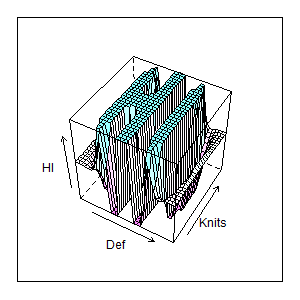

Application for Technology Development
======================================

Autumn 2016
-----------

Project Description
===================

Sproti
------

### Company name: HiDef Textiles

### Project title: HiDef Knits

Instructions
------------

Please following items in the preparation of project descriptions. The applicant
must answer all the items below, otherwise the application dismissed. That reads
"Text" you can write text, insert images or tabletting. The application can not
be longer than 20 pages, excluding the cover, summary, table of contents and
bibliography. It is forbidden to change the width margin nor have the font size
smaller than 11-point Calibri (Body) or equivalent. If application is made for
other than MS Word format example PDF, the applicant must pay close attention to
page number before submitting the application. Those who do not have access to
MS Word are advised to use OneDrive. Additional information and rules can be
found on the website Rannís. The application deadline is at. 16.00 per
application deadline is entirely equation 15 February and 15 September except
where these days carry a weekend or public holiday. The application deadline
moves to the next ordinary working day.

Summary
=======

Text (Summary of a maximum 1 page).

1 Description of the project
============================

1.1. Objectives
---------------

-   *Describe the project and its objectives. What are the estimated results /
    products project nature are the products (such as tools, equipment,
    software, service).*

text

1.2. State of the art
---------------------

-   *Please describe the state of knowledge (e. State of the art) domestically
    and abroad in the areas for the project and how the project can add existing
    knowledge in the relevant field.*

text

1.3. project status
-------------------

-   *Give an account of the work that has taken place before the decision to
    start the project. Have a technical or market pilot study been conducted?
    have freedom of action have been investigated in search of patent databases?*

text

2 Novelty
=========

2.1. Market situation
---------------------

-   *Please describe the potential market segment and market position. Please
    describe the the need of the market (domestic and / or foreign) and the
    manner in which the product answers it. Describe the competitors and the way
    the product is different from the products other competitors.*

text

2.2. Challenges
---------------

-   *Describe technical and design challenges bearings, which involve the
    development product.*

text

2.3. Derived opportunity (Spin-off)
-----------------------------------

-   *Describe the potential secondary opportunities that can lead to, for
    example, for new knowledge of the project and / or the use of the product.*

text

2.4. Intellectual property policy
---------------------------------

-   *Describe your business plan on how to be a possible intangible property
    (patent, trademark protection, design) obtained from the project. *

text

3 Organization and Management
=============================

3.1. Management
---------------

-   *Give an account of how the project is managed, who control and
    responsibility each participant. Specify the project manager, who is in
    control project and its division of labor. *

text

3.2. Cooperation
----------------

-   *If the case of a cooperative, describe the nature of the partnership and
    value for the project. Please describe the role of all partners project.
    Describe cooperation both with domestic and foreign partners. *

text

3.3. Budget
-----------

-   *Please describe the costs and funding. How will react if the projected
    funding for the project does not? *

text

4 Value
=======

4.1. Business objectives
------------------------

-   *Describe your business objectives. Please describe the turnover of the
    product may applicants made the market the first 5-10 years after the
    product comes first market. What market share is planned. *

text

4.2. Way to market
------------------

-   *Give an account of how to bring a product to market (including methodology,
    estimated market share, financing and production). Describe the market
    context and capacity of the applicants to bring the product to market. What
    is the main commercially uncertainty in the project? *

text

4.3. General value
------------------

-   *Describe the manner in which the results of the project can increase value
    creation in Iceland excess income of the product (efficiency or increased
    revenues by other residents the use of the product). *

text

5 References
============
